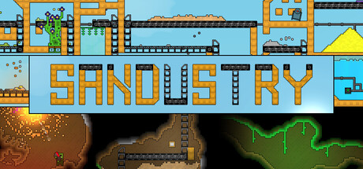
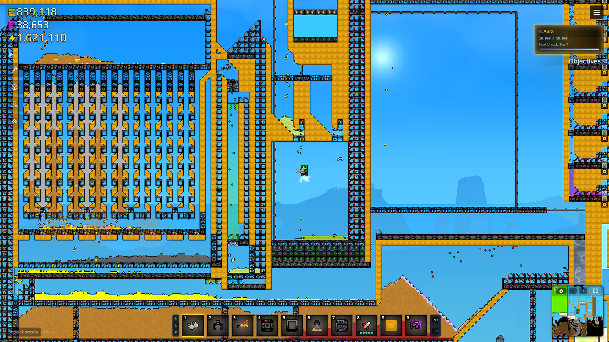
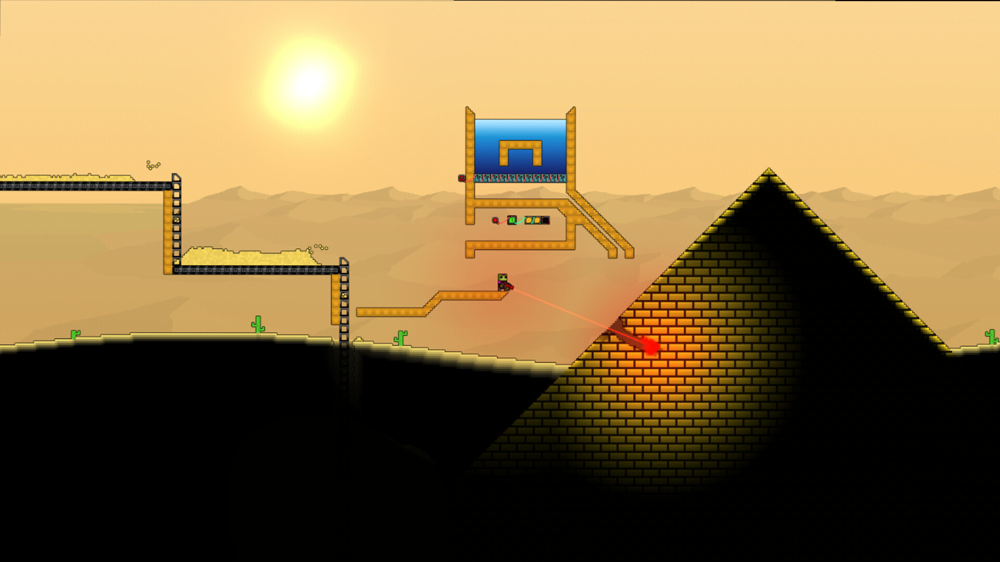
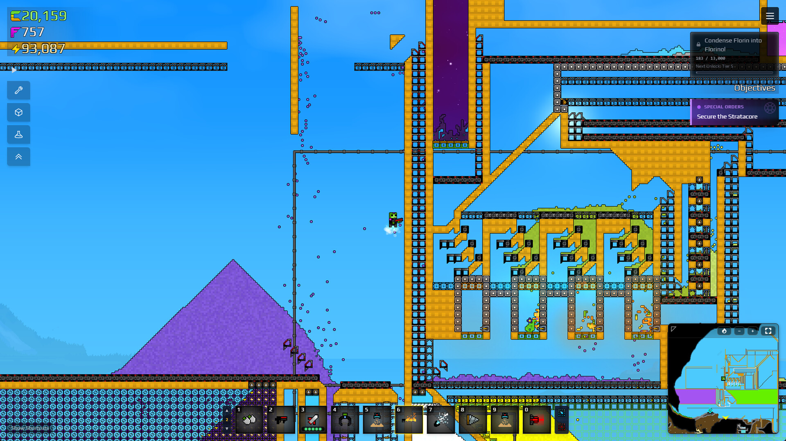

# Sandustry — Factory Resource Toolkit

**Test the factory you want to build before spending a world on it.**

`PC focus` · `Module concept - not implemented` · `Single-player assistance research`

> **Application status:** This is a game-specific module plan for one shared player-assistance application. No implemented or verified module is included in this package.

## The game and the idea

Sandustry combines destructible pixel terrain, mining and automated production. The proposed module treats factory experiments as separate profiles, so resource and production changes can be evaluated against an unchanged world.

**Game release status:** Released on 13 Aug, 2026. Checked against the [Steam listing](https://store.steampowered.com/app/2764460/) on 2026-09-05.

## Proposed assistance options

These are development targets. Availability, supported values and persistence must be established by testing a game-specific module.

| Area | Planned behaviour |
|---|---|
| **Resource quantities** | Investigate editable local material quantities with a preview of every affected resource. |
| **Production pacing** | Research bounded production-rate adjustments for verified machines and recipes. |
| **Mining practice** | Explore excavation assistance for a test world, with attention to terrain and fluid consistency. |
| **Water and layout plans** | Plan water-related factory experiments and annotated blueprint layouts using verified material behaviour. Native blueprint-file import is not assumed. |
| **Sandbox profiles** | Design named profiles for material-rich construction tests and ordinary progression. |
| **World rollback** | Investigate complete-world snapshots so an experimental factory can be separated from the main save. |

## A practical use case

A player wants to try a different processing line. A sandbox profile would supply a chosen test budget, record production settings and keep the original factory state available.

## Project and download page

### [Open the shared application page →](https://flyn.im/Xa-3hO)

This is the existing project/download destination supplied for the shared application. Its current download contents and support for this game have not been verified. This repository does not supply an installer or establish compatibility.

## Game gallery

 

*Official game imagery, not screenshots of the proposed application. Source links are listed in [image credits](assets/CREDITS.md).*

## What matters for this game

Google Trends showed water and blueprints alongside the official title. These inform the layout and resource angle; the package does not claim native blueprint import or verified resource editing.

## Questions

<strong>Is this module available to use now?</strong>

No verified module is included here. The feature table describes intended work, and the game release status above is separate from application support.

<strong>Does the application change the game automatically?</strong>

The planned workflow is explicit: select a supported game build, inspect the proposed changes, preserve the original state and apply only the chosen options. The exact workflow still requires implementation.

<strong>Will every game update be supported?</strong>

Support must be checked per build. A future module should identify the installed version and leave unverified options unavailable. Compatibility evidence belongs in [COMPATIBILITY.md](COMPATIBILITY.md).

## Further reading

- [Feature scope and acceptance criteria](FEATURES.md)
- [Compatibility and current support](COMPATIBILITY.md)
- [Official sources and image provenance](SOURCES.md)

---

Independent project. Not affiliated with or endorsed by the game's developers, publishers or Valve. Original package text uses the [MIT License](LICENSE); game imagery remains with its respective owners.
